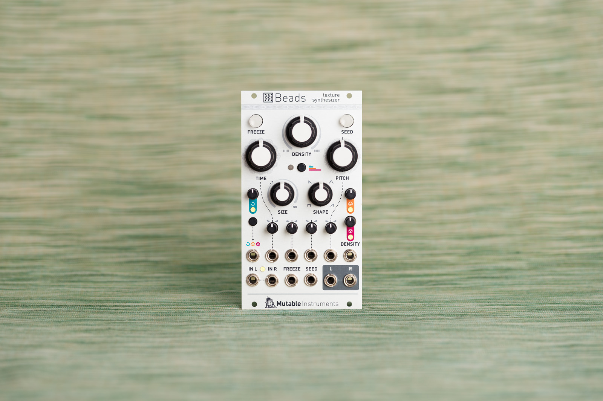
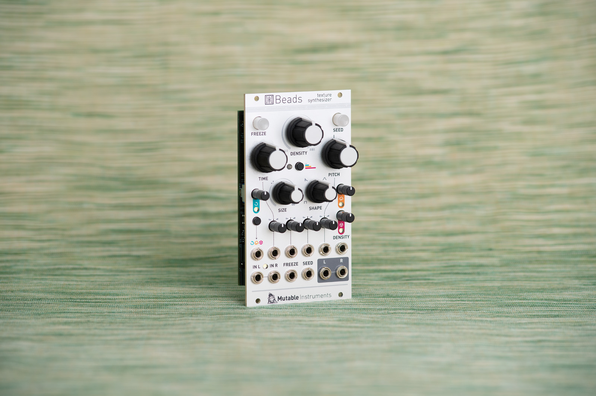
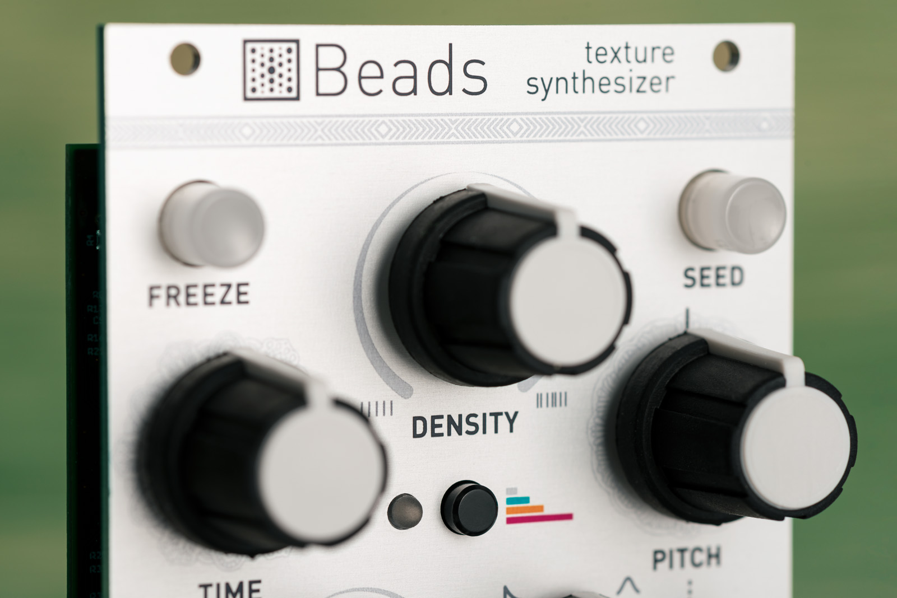
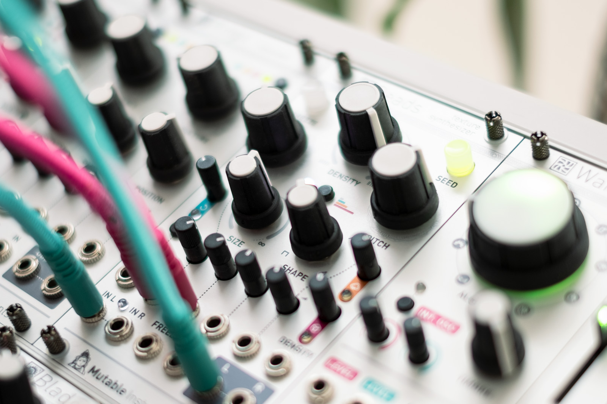

## Reinventing a classic

Beads is a reinvention of Mutable Instruments' Clouds.

The concept is the same, live granular processing of an incoming audio signal, and the labels on the panel remain familiar.

The similarities stop here. The hardware and software have been **redesigned from the ground up**, with several goals in mind: a crisper and broader sound palette, more control, better playability, and direct access to exciting new features.

## Dotting the i's and crossing the t's

Beads' **vastly improved specifications** allow a higher audio quality, a longer buffer, the use of better interpolation and anti-aliasing algorithms, and key DSP blocks to run at a faster rate. Granular processing can now go to new territories, such as formants, wavetables, hard-sync-like sounds, or crispy noise.

The range of parameters, their response to the turn of a knob or a CV modulation have all been refined, for **new possibilities** such as reverse playback or percussive envelopes.

## Control, chaos and character

**Control**. To trigger or schedule grains, Beads provides new features to divide or randomize an external clock or trigger stream, spray bursts of grains in response to a gate, or get the grain rate to track a V/O CV or the frequency of an external oscillator.

**Chaos**. Each key parameter of a grain comes with its own **attenurandomizer**, which allows direct CV control, CV control of the randomization (spread) of this parameter, or internal randomization using some of Marbles' algorithms.

**Character**. Beads provides four audio quality settings, which go well beyond buffer sample rate and bit-depth: they affect the clock of the converters, the amplitude limiting and saturation of the signal path, the tone of the reverb, and additional media-emulation effects. From a pristine digital device to a dirty cassette, through a mode reproducing some of Clouds' characteristics.

## Modes?

Beads can operate as a **delay** without the need to switch to a different mode: just ask it to play a never-ending grain. Its **DENSITY**, **TIME** and **SEED** controls are repurposed to allow various features such as tap-tempo, beat slicing, time-stretching, or comb-filtering at rates tracking V/O.

Without any audio input, Beads will granularize **8 internal banks** of wavetables.

