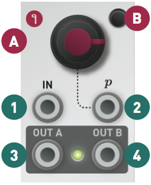

## Installation

Branches requires a **-12V/+12V** power supply (2x5 pin connector). The ribbon cable connector must be aligned so that the red stripe of the ribbon cable (-12V) is on the same side of the module's power header as the "Red stripe" marking on the board. The power consumption is 10 mA on the +12V rail and 1 mA on the -12V rail.

## Controls

Branches consists of two identical sections called Bernoulli gates. An internal connection routes the input of section 1 to section 2 – unless a jack is connected into the input of section 2.

### The Bernoulli gate

Upon receiving a trigger on its **IN** input **(1)**, the module tosses a virtual coin: if the outcome is heads, the trigger is sent to **output A (3)**; if the outcome is tails, the trigger is sent to **output B (4)**.

The **probability knob (A)** and the associated **CV input (2)** change the odds of the "heads" and "tails" outcomes. In extreme settings, the outcome is no longer random - causing the module to behave like a voltage-controlled switch.

### Toggle mode

In **toggle mode**, the module associates the "heads" and "tails" outcomes to a different pair of decisions: "continue sending the trigger to the same output as before" and "send the trigger to the opposite output". As a result, when the probability knob **(A)** is set to its maximum value, the trigger will alternate between outputs A and B.

Press the **switch (B)** to enable or disable the toggle mode.

### Latch mode

When the **latch mode** is enabled, an output **(3)** or **(4)** stays at +5V until the other output gets activated.

Hold the **switch (B)** for more than 1s to enable or disable the latch mode.

Toggle and Latch settings are kept in memory even if the module is powered off.
